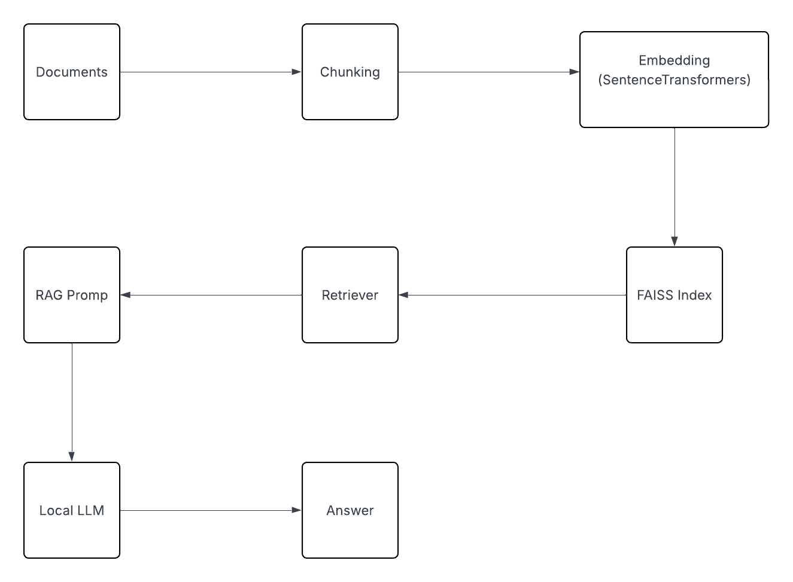
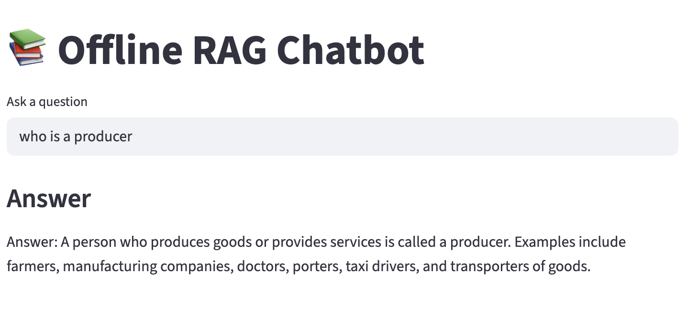

# Offline RAG Chatbot

This repository contains a fully offline Retrieval-Augmented Generation (RAG) prototype. It demonstrates an end-to-end local pipeline for ingesting documents, building a vector index, and answering user questions with a local GGUF LLM. No paid APIs or cloud-hosted models are required.

## Table of Contents

1. [Project Overview](#project-overview)
2. [System Architecture](#system-architecture)
3. [Technology Stack](#technology-stack)
4. [Installation](#installation)
5. [Usage](#usage)
6. [Features](#features)
7. [Dependencies](#dependencies)
8. [Configuration](#configuration)
9. [Examples](#examples)
10. [Troubleshooting](#troubleshooting)
11. [Contributors](#contributors)
12. [License](#license)

---

## Project Overview

The system:

* Ingests documents from a local folder, splits them into chunks, and embeds them with an open-source sentence-transformer.
* Builds a FAISS index of embeddings and saves the index and text chunks to disk.
* Runs a local LLM (GGUF format via GPT4All / llama.cpp) to generate answers constrained to retrieved context.
* Provides a minimal Streamlit UI for interactive querying.

**Why an offline RAG approach?**

* **Reproducibility & Privacy:** All data and models remain on the host machine.
* **Cost Control:** No external API or paid LLM dependency.
* **Portability:** Ideal for take-home projects or interviews without internet access.

---

## System Architecture

High-level pipeline:
`ingestion → chunking → embedding → index build → retrieval → generation (inference)`

**Component Responsibilities:**

* **Ingest:** Loads PDF/TXT files from `data/docs/` and splits text into chunks.
* **Embed / Index:** Encodes chunks using SentenceTransformers and writes FAISS index + pickled chunks.
* **Retrieve:** Performs k-NN search on the FAISS index to get top chunks for a query.
* **Generate:** Uses a local GGUF LLM for context-constrained answers.
* **UI:** Streamlit front-end for interactive querying.
* **Evaluation:** Metrics like Recall@K and Context Precision.

**Architecture Diagram:**


---

## Technology Stack

* **SentenceTransformers (`all-MiniLM-L6-v2`)** — lightweight embeddings
* **FAISS (`faiss-cpu`)** — efficient nearest-neighbor search
* **GPT4All / llama.cpp (GGUF)** — local LLM
* **PyPDF2** — PDF text extraction
* **Streamlit** — minimal web UI
* **NumPy / scikit-learn** — numerical utilities

---

## Installation

```bash
git clone https://github.com/jasgunchandnani/offline-rag-chatbot.git
cd offline-rag-chatbot
pip install -r requirements.txt
```

---

## Usage

1. Place your documents in `data/docs/`.
2. Run ingestion and embedding scripts:

```bash
python src/ingest.py
python src/embed.py
```

3. Launch Streamlit UI:

```bash
streamlit run app.py
```

**Streamlit Interface:**


---

## Features

* Offline document ingestion and indexing
* Context-aware question answering
* Local LLM generation with GGUF
* Minimal, interactive web UI
* Evaluation metrics for retrieval quality

---

## Dependencies

* Python 3.10+
* `faiss-cpu`
* `sentence-transformers`
* `gpt4all`
* `PyPDF2`
* `streamlit`
* `numpy`, `scikit-learn`

---

## Configuration

* Change documents folder: `data/docs/`
* Set local GGUF model path in `src/llm.py`

---

## Examples

* Ask questions from your PDF/TXT documents through the Streamlit interface.
* Evaluate retrieval quality with `src/evaluate.py`.

---

## Troubleshooting

* **Streamlit not opening:** Ensure proper Python environment and `streamlit` installed.
* **FAISS errors:** Verify embeddings are generated before querying.

---

## Contributors

* [jasgunchandnani](https://github.com/jasgunchandnani)

---

## License

This project is licensed under the MIT License.

---
